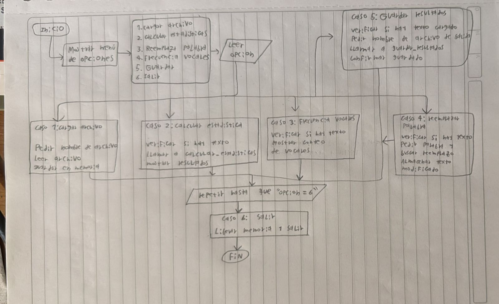

## 1. **Explicación del análisis del problema**: ##
    
    Describan, con sus propias palabras, cómo entendieron el problema, qué decisiones tomaron para resolverlo y por qué.
El programa debe analizar archivos de texto (.txt), a traves de un menú que permita cargar el archivo, calcular las estadisticas correspondientes, reemplazar palabras, guardar resultados y calcular la frecuencia de vocales.

Todo esto para entrarle al usuario el conteo de caracteres, palabras, espacios y lineas. Poder buscar una palabra en el texto y cambiarla por otra. Mostrar cuantas veces aparece cada vocal sin distinguir si es mayúscula o minúscula y al final, exportar todos estos datos y cambios de haber sido hechos a un nuevo archivo.

Para el menú interactivo se usa un bucle do-while con switch-case para manejar las opciones, la memoria dinámica para usarla en este trabajo se almacena el ltexto en un puntero char con malloc y se libera con free cuando ya no se necesita y cada operacion ya sea de lectura, estadística o reemplazo está guardada en una funcion para una mejor lectura del codigo.

Para la lectura del archivo se abre con "r", se determina su tamaño con fseek y ftell, se reserva memoria con malloc y se lee con fread ademas de verificar si el archivo existe y se pudo abrir que de lo contrario salta un error

En la lectura de las estadisticas se contarán todos los caracteres menos los espacios, este tambien tendra su propio contador, el conteo de palabras se hará con un contador que cada vez que encuentra un espacio o salto de linea se incrementará.

La frecuencia de las vocales se hará con un repason del texto pasado a minúsculas con tolower y se compara con a,e,i,o,u a partir de un arreglo de 5 para guardar los conteos.

El reemplazo de palabras se hace buscando la palabra con la funcion strstr, contando el numero de veces que aparece la palabra, se reserva la memoria y se copia el texto nuevo con la palabra ya cambiada.

Finalmente para guardar el nuevo archivo, se abre con "w", se reescribe con las estadisticas y se cierra el archivo.

## 2. **Estrategia de solución** ##

El programa se organiza en su función principal main y sus funciones auxiliares que harán el trabajo de trabajar cada item requerido por el profesor. A su vez, la función main va a conectar cada función a partir de la conocida expresión de "llamada", donde main va a llamar a la función leer_archivo() que guarda el texto, main va a pasar el texto a las funciones del calculo de estadisticas y decidirá despues a peticion del usuario guardar o no los resultados con la respectiva función.

En sintesis lo anterior dicho se resumen en las siguientes funciones que contiene main ya explicadas anteriormente con ams detalle

- leer_archivo()= guarda el texto en la memoria dinamica.
- calcular_estadisticas()= maneja los conteos.
- frecuencia_vocales()= contabiliza las vocales.
- reemplazar_palabra()= genera el texto_modificado.
- guardar_resultados()= genera el archivo de salida.

## 3. **Tabla de variables** ##

- Funcion leer_archivo

|  funcion | Variable | tipo  | rol |
|---|---|---|---|
| leer_archivo  | nombre_archivo  | const char*  | Entrada  |
|  leer_archivo | longitud  | long*  |  salida |
|  leer_archivo | return  | char*  |  salida |

- Función calcular_estadisticas

| funcion | variable | tipo | rol |
|---------|----------|------|-----|
|calcular_estadisticas|  texto |  const char*  | Entrada    |
|calcular_estadisticas|  caracteres | int*  |  salida   |
|calcular_estadisticas|  palabras | int*  | salida    |
|calcular_estadisticas|  espacios | int* |  salida   |
|calcular_estadisticas|  lineas| int*|  salida   |

- Función frecuencia_vocales

| funcion | variable | tipo | rol |
|---------|----------|------|-----|
|frecuencia_vocales  | texto |const char*   | entrada    |
|frecuencia_vocales  | frecuencia |int[5]      | salida  |

- Función reemplazar_palabra

| funcion | variable | tipo | rol |
|---------|----------|------|-----|
|reemplazar_palabra | texto | const char*  | entrada    |
|reemplazar_palabra | buscar | const char*  |entrada     |
|reemplazar_palabra | reemplazo | const char*  | entrada    |
|reemplazar_palabra | nueva_longitud |long*      | salida    |
|reemplazar_palabra | return |char*     | salida    |

- Función guardar_resultados

| funcion | variable | tipo | rol |
|---------|----------|------|-----|
|guardar_resultados | nombre_archivo         |  const char*    |  entrada   |
|guardar_resultados | texto         | const char*     |  entrada   |
|guardar_resultados | caracteres         | int     |  entrada   |
|guardar_resultados | palabras         | int     | entrada    |
|guardar_resultados | espacios         | int     | entrada    |
|guardar_resultados | lineas         |  int    |  entrada   |
|guardar_resultados | frecuencias         | const int[5]     |  entrada   |

- Función main

| funcion | variable | tipo | rol |
|---------|----------|------|-----|
|   main      |   texto       |  char*    |  local   |
|    main     |   texto_modificado       | char*     |  local   |
|   main      |   nombre_archivo       | char [MAX_LENGTH]     |   local  |
|   main      |   nombre_salida       | char [MAX_LENGTH]     | local    |
|   main      |   opcion       |  int    | local    |
|  main       |   caracteres       | int     |  local   |
|  main       |   palabras       | int     |  local   |
|  main       |   espacios       | int     | local    |
|  main       |   lineas       |  int    | local    |
|  main       |   frecuencias       | int[5]     | local    |
|  main       |   buscar       | char [MAX_LENGTH]     | local    |
|  main       |   reemplazo       |  char [MAX_LENGTH]    |  local   |

## 4. **Diagrama** ##

